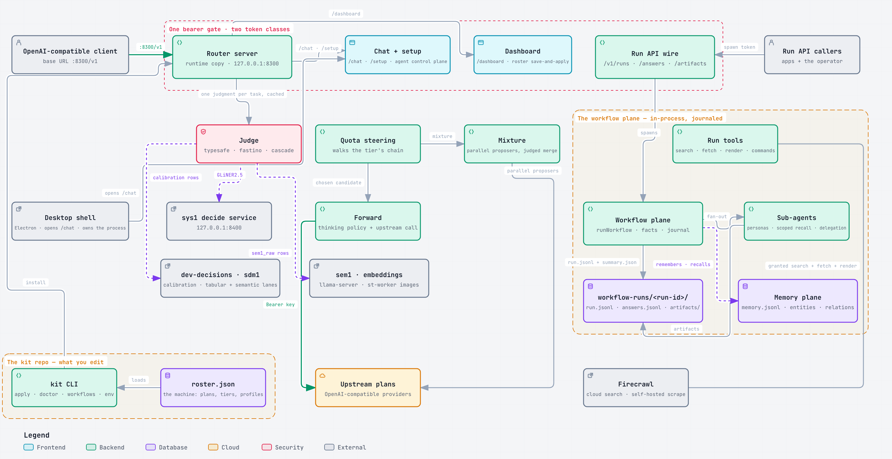
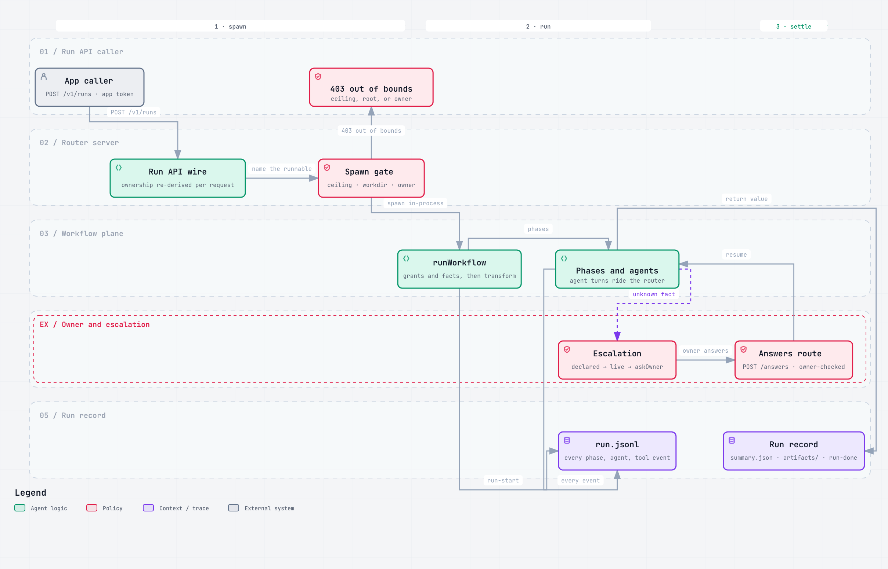
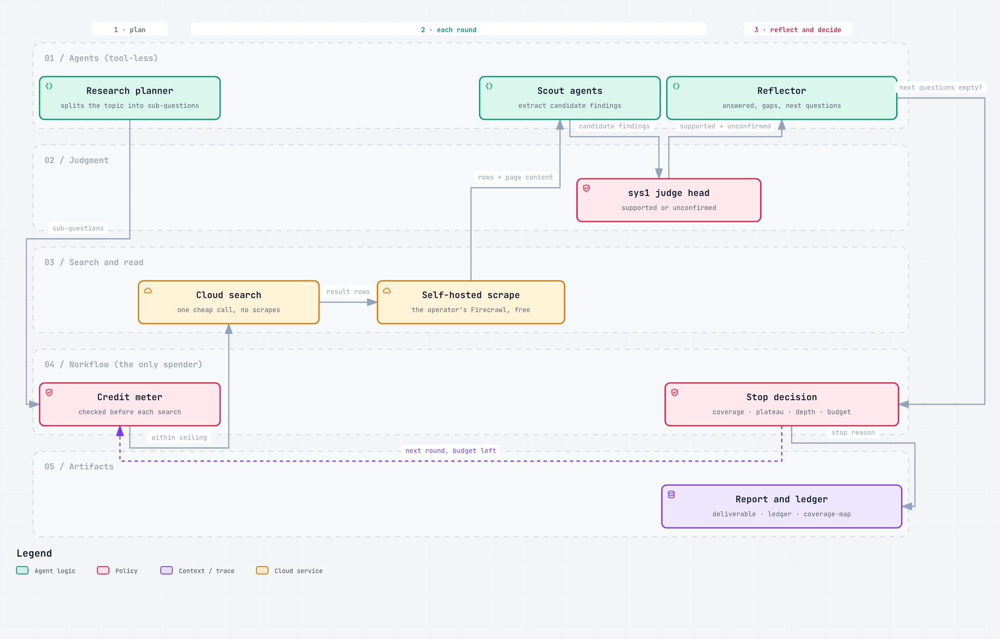
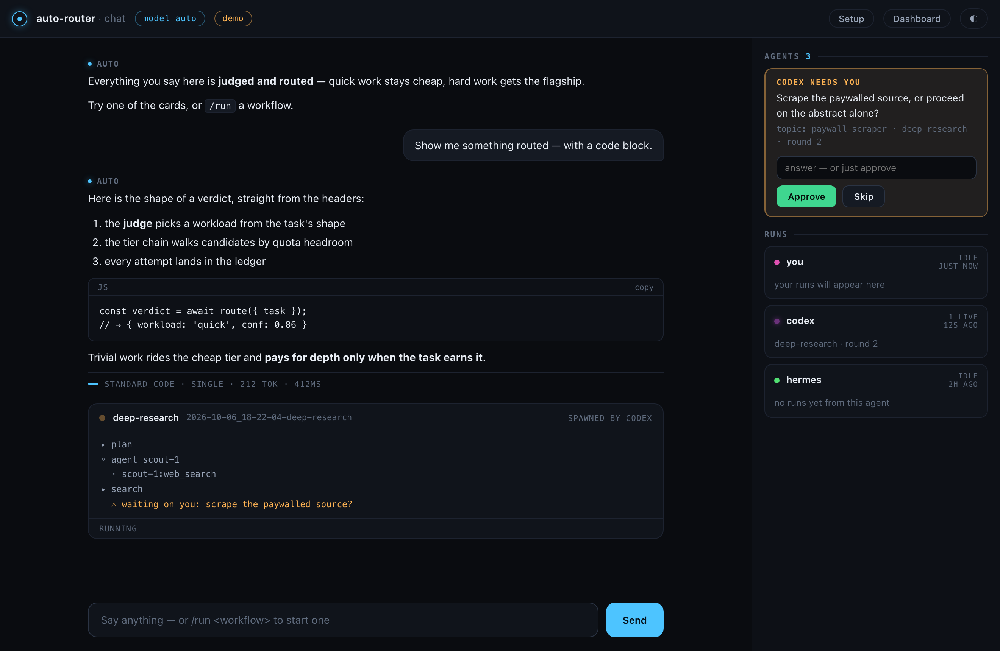

# agnostic-router-kit

A local, harness-neutral model router **and the workflow plane it runs**. This repo is the engine edition: it owns the
plane (`lib/workflow/`) and the proxy that serves it, and it depends on no harness anywhere.

Point any OpenAI-compatible client at `http://127.0.0.1:8300/v1` and it gains one extra model id — `auto` — that routes
each request to the right upstream plan by workload, judged per task, with quota-aware failover and every token metered.
Point a caller at the run API and it gains a journaled agent run: outcomes, phases, paths, escalations, artifacts.

No harness is required, none is read, and nothing about one is assumed. The router knows your roster and nothing else.

```
roster.json ──kit apply──┬── ~/.agnostic-router-kit/router/config.json    tier table, judge mode, app rows and ceilings
                         ├── ~/.agnostic-router-kit/router/               the service's copy of the proxy
                         ├── ~/.agnostic-router-kit/router/.env           env-var NAMES only; values stay local (chmod 600)
                         └── ~/.agnostic-router-kit/workflow-runs/<id>/  run.jsonl, summary.json, artifacts/

OpenAI-compatible client ──► one bearer gate ──► judge (workload · execution · workflow · followUp) ──► tier chain walk
                                                      │
App caller (run API) ──► same gate ──► spawn gate (ceiling · root · owner) ──► workflow plane ──► run.jsonl + artifacts
```

Requires Node ≥ 20 and one `npm install` at the root: the kit's only dependency is the plane itself, resolved as a
`file:` package (`node_modules/workflow-plane` → `lib/workflow`), and the CLI imports it by that specifier, so a fresh
clone links it before anything runs. The plane declares `engines.node: ">=20"`, so the whole kit inherits that floor.
The router has one more dependency, `@typesafe-ai/sdk` — the judge that picks the workload, the execution style, and
the workflow for every `auto` request. It is needed in the runtime dir (`~/.agnostic-router-kit/router/`), and
`kit apply` ships the kit's own install of it there, so the repo-side step is one `npm install --omit=dev` in
`router/` per clone. `kit apply` and `kit doctor` both report it when the runtime is missing it; the fix is the same
command run in the runtime dir.

**The workflow plane lives in this repo**, in `lib/workflow/` — 14 modules, zero runtime deps: run state and
checkpoints, judging and gates, tool grants and the world, transport, the event journal and the session graph. It ships
to the runtime beside the router and it is imported by the shipped server, so a kit installed from this checkout cannot
drift from the engine. The ZCode edition (`zcode-router-kit`) is one of its consumers: it resolves the plane from here
as a `file:` dependency rather than copying it.

Three diagrams, generated from candidates that cite the code: a map of the machine and two process views. The stills
below are light-theme renders; the interactive versions carry the file and line behind every node and edge.

<p align="center">
  <a href="docs/architecture/system-overview.html"></a><br>
  <sub><b>System overview</b> — every component, boundary and connection ·
  <a href="docs/architecture/system-overview.html">interactive</a> ·
  <a href="docs/architecture/overview.md">text</a></sub>
</p>

<p align="center">
  <a href="docs/architecture/run-lifecycle.html"></a><br>
  <sub><b>Run lifecycle</b> — spawn, phases, escalation, settlement ·
  <a href="docs/architecture/run-lifecycle.html">interactive</a></sub>
</p>

<p align="center">
  <a href="docs/architecture/deep-research-loop.html"></a><br>
  <sub><b>Deep-research loop</b> — the credit meter, the sys1 judge head, the stop reasons ·
  <a href="docs/architecture/deep-research-loop.html">interactive</a></sub>
</p>

## What you get

- **Routes by workload.** One judgment per task — the sys1 decide provider (a
  [sys1](https://github.com/adelvillar1/sys1) decision service on `127.0.0.1:8400`), TypeSafe Jev, or cascade (sys1
  first, Jev escalates on low confidence) — picks one of your tiers: `quick`, `standard_code`, `hard`, `prose`,
  `deep_context`, each mapped to a provider/model with an ordered fallback chain.
- **Respects plans.** Quota-aware steering walks the tier's candidate chain, records every attempt in a usage ledger,
  and never fails a request: judge outages, missing keys, and exhausted quotas degrade to the next candidate, tagged
  in the log and in response headers.
- **Mixture for the hard stuff.** Named profiles fan out to parallel proposers and merge with a best-answer judgment.
- **A workflow plane, journaled.** Runs decompose a task into phases, call agents that use real tools under declared
  grants, escalate questions to a named owner, and write artifacts — every event in `run.jsonl`, every judgment in a
  calibration store.
- **The run API.** `POST /v1/runs` starts a run for an app token, `POST /v1/runs/<id>/answers` answers its escalations
  live, `GET /v1/runs/<id>/artifacts` reads what it produced. Ownership is re-derived from the journal, so a restart
  never reopens the door.
- **A loop library.** Fifteen loops over the plane, in three lanes, plus the one-pass workflows they were built
  from. Seven loop shapes anchor the library — deep-research, remediate, triage, refine-loop, red-team, watchdog,
  router-eval. Six tabular loops ride the dev-decisions
  lane: quota-forecast (per-plan exhaustion bands, an in-band crossing escalates), flake-watch (known-flaky suites
  named, quarantine don't chase), calibrate-floors (proposed per-head confidence floors beside the static ones —
  proposes, never writes), risk-composed review (findings annotated with directory revert risk; the swarm's gate
  double-gates parts that touch a top-decile-risk directory), triage eval (sdm1 routing predictions journaled
  eval-only, never applied), and fleet-watch (watchdog runs flag repos deviating from fleet peers). Flat judgments
  ride the sys1 judge layer; the LLM agents do generation only. See
  [`docs/features/tabular-decisions.md`](docs/features/tabular-decisions.md).
  The semantic lane (dev-decisions' third model class — embeddings over the
  graded history and over file corpora) adds dupe-watch (near-dupe pairs over
  the calibration store: divergent grades escalate, agreeing pairs become
  merge proposals — report-only) and render-watch (a wave's PNGs embedded,
  unchanged re-renders counted as would-skip against the visual-judge — in
  shadow, nothing is skipped) — with the review-sweep dedup head, the
  router-eval neighbor annotations, and the shadow router as consumers of the
  lane rather than loops. Embeddings propose, sys1/sdm1 dispose. See
  [`docs/features/semantic-lane.md`](docs/features/semantic-lane.md).
- **Dashboard.** The router serves its own dashboard at `/dashboard` — the usage ledger, provider enable/disable,
  quota status, the delegation and workflow assignment view, live run activity, and a Save & apply button that writes
  the roster and re-renders it in place.
- **A durable memory plane.** One JSONL knowledge graph under the kit home — entities, relations, observations in the
  official MCP format, carrying mnemosyne's deterministic machinery: veracity, compounding SPO facts with conflict
  detection and supersession, temporal triples, a scratch tier that consolidates into digests, and ranked recall.
  Served to harnesses by a native zero-dependency MCP server (`kit memory config` prints the wiring), to apps over
  `/v1/memory` behind the `memory` capability, and to you from the chat (`/remember`, `/recall`) and the terminal
  (`kit memory`). Imports from mnemosyne or any graph-format store.
- **A chat and an agent control plane.** `/chat` is a conversation with the router (streamed, verdict shown) beside a
  live view of every connected harness — its runs, its journals, and its open questions, answerable in place.
  `/setup` is the guided half of installation: the router computes what is missing, the browser collects it.

## New-machine quickstart

**The one-command path** — asks a few questions (keys included, entered hidden), runs every step below, and ends with a
green doctor and a link to the chat:

```bash
git clone git@github.com:adelvillar1/agnostic-router-kit.git && cd agnostic-router-kit
node bin/agnostic-router-kit.mjs quickstart
```

Scripted or containerized installs take the same road without prompts: `kit quickstart --yes --skip-install --skip-service`.

**The manual path**, for power users who want to see every gear — each step is what the wizard runs:

```bash
git clone git@github.com:adelvillar1/agnostic-router-kit.git && cd agnostic-router-kit

# 0. sys1, the decision service on 127.0.0.1:8400 — or skip it and set judge.mode=typesafe
#    git clone https://github.com/adelvillar1/sys1 && cd sys1 && ...   # see its README

# 0b. the kit's one link — the root package resolves workflow-plane as a file: dep on lib/workflow
npm install                                     # node_modules/workflow-plane → lib/workflow; the CLI imports it by that specifier

# 1. a roster to edit — the documented template, or a copy of a live machine's
node bin/agnostic-router-kit.mjs init --template      # or: kit init   (on the source machine, then commit roster.json)

# 2. the keys this machine has (names come from the roster)
node bin/agnostic-router-kit.mjs env set STEPFUN_API_KEY=… TYPESAFE_API_KEY=… ZAI_CODING_API_KEY=…

# 3. render + install everything, then check it
#    the router's one dependency, so kit apply can ship it to the runtime dir
(cd router && npm install --omit=dev)               # once per clone
node bin/agnostic-router-kit.mjs apply --dry-run      # see exactly what would change
node bin/agnostic-router-kit.mjs apply
node bin/agnostic-router-kit.mjs doctor               # --live also probes each provider; green or it didn't happen

# 4. point a client at the router
curl http://127.0.0.1:8300/v1/chat/completions \
  -H "Authorization: Bearer local-auto-router" \
  -H "Content-Type: application/json" \
  -d '{"model":"auto","messages":[{"role":"user","content":"say hi"}]}'

# 5. run a workflow on the plane, on the spot
node bin/agnostic-router-kit.mjs workflows run deep-research --args '{"topic":"…"}' --grant net-search
```

`model` accepts `auto`, any profile name in the roster (`quick`, `code`, `hard`, `prose`, `long-context`, `vision`,
`mixture`, `deep`, `bulk`), or a literal `providerId/modelId` target. The default operator token is the roster's
`router.localToken`; app callers use their own row token.

## Surfaces in the browser (and on the desktop)

Once the router runs, the terminal is optional:

- **`/chat`** — chat with the router (`model: auto`, streamed, the routing verdict under every reply) and watch every
  connected agent — ZCode, Codex, Hermes, anything holding an app token — with its live runs. When a run needs a human
  decision, the question appears right there with an answer box; the run holds for you (spawn with `awaitOwnerMs`) and
  resumes the moment you answer.
- **`/setup`** — the guided half in the browser: a readiness checklist computed by the router, key entry (write-only —
  values land in the local `.env`, chmod 600, and never come back), and a connect-an-agent flow that mints an app token
  and hands you the three lines a harness needs: base URL, token, `model: auto`.
- **`/dashboard`** — the power console: usage ledger, provider enable/disable, quota, delegation, live run activity.
- **The desktop shell** (`app/`, Electron) opens `/chat` in its own window, starts the router when no service manages
  it, and dies with it when it does. `npm start` inside `app/`; `--preflight-check` verifies the non-GUI half.

<p align="center">
  <a href="docs/screens/chat-demo-dark.png"></a><br>
  <sub><b>/chat</b> — conversation + agent control plane ·
  <a href="docs/screens/chat-live-escalation.png">live escalation</a> ·
  <a href="docs/screens/chat-welcome-light.png">light</a> ·
  <a href="docs/screens/setup-pending-dark.png">/setup</a> ·
  <a href="docs/screens/">all seven states</a></sub>
</p>

## Everyday use

```bash
kit status                 # what's installed, which tiers resolved, router health, remaps
kit doctor [--live]        # full verification of the whole chain; changes nothing
kit workflows list         # the library, its install state, and router-assignability per workflow
kit workflows run <name>   # run a workflow on the plane, on the spot (--args, --answers, --grant)
kit workflows watch [id]   # tail a run's journal
kit workflows graph [--dot|--archify out.json]   # the session graph: plans, criteria, phases, runs
kit route "audit the docs tree for staleness"    # ask the running router for its verdict
kit apply [--only router|service]                # render + install + restart + health-check (idempotent)
kit upgrade                # git pull + apply
open http://127.0.0.1:8300/dashboard             # usage ledger, providers, quota, delegation, live run activity
```

`kit workflows run` takes a workflow file — a `.ts` beside the library or a direct path — answers its questions with
`--answers`, grants capabilities with `--grant`, and journals every event for `watch` / `graph`. `graph --archify` hands
the result to archify, the tool that drew the diagrams above.

## Configuring the roster

`roster.json` is the machine's description; `kit apply` renders it and everything under `~/.agnostic-router-kit/` is
generated. Commit the roster — it holds env-var *names*, never values — and let `kit env` manage the values.

- **providers** — `providerName`, `baseUrl`, `apiKeyEnv` (the variable's name), `models[]` (the picker's list),
  optional `billing`, `featured[]`, `routerOnly`, `quota`, `contextWindow`. Per-model strength lives at the top level
  under `strength`.
- **tiers** — an ordered candidate chain per workload tier. The chain walk is quota-aware: a candidate that is cool
  ing down, over its allowance, lacking a key, or declared (top-level `manualModelRules`, per model: `supportsImages`,
  `supportsTools`, `contextWindow`) to lack a capability the request carries is skipped and the skip is journalled.
- **profiles** — named routing decisions on top of the judge: pin a tier, force mixture on a profile name, or route a
  literal target.
- **router.apps** — the second token class (see below): `token`, `grantCeiling`, `workdir`/workspace root.
- **judge** — `mode: typesafe | fastino | cascade`, plus the sys1 endpoint and model settings.
- **search / scrape** — the run's search backend — `auto` is keyless-first (DuckDuckGo) with Firecrawl as the quality
  fallback — and the operator's self-hosted Firecrawl (`FIRECRAWL_SCRAPE_URL`), the middle rung of the scrape ladder:
  local moli first (the `browser` grant, default-off), Firecrawl when the browser can't, plain fetch as the floor.

`templates/roster.defaults.json` documents every field with its default.

## How the router decides

One `POST /v1/chat/completions` with `model: "auto"`:

1. **Capability rules** (always win): images → `omniModel`; length > `wideChars` → `wideModel`.
2. **Judgment cache**: hash of system-prompt head + latest instruction; a hit reuses the verdict, so agentic loops keep
   one verdict for a whole task.
3. **Judge** (one verdict per task, fail-open): workload tier, execution style (`single` / `mixture`), first workflow,
   optional follow-up. Fastino judges a batch in one call; cascade escalates to TypeSafe on low confidence. A judge
   outage degrades to the default workload and the request is still served.
4. **Execution**: a single call; or parallel proposers plus an integration judgment (mixture); or a delegate to a
   workflow in the library.
5. **Tier chain walk**: quota-aware candidate order; parity first — a fallback that declares it lacks a capability the
   request carries (images, tools) is excluded before steering. Upstream `402/403/408/429/5xx` or a connection failure
   is classified (`router/failclass.mjs`: usage-limit vocabulary before the 429 pattern — a subscription cap is a quota,
   not a rate limit; quota/billing bodies are never a key fault; a model gap walks without benching), then moves to the
   next candidate and opens a bench per its class; roster cooldown overrides win first. A benched provider steers as
   zero headroom.
6. **Metering**: every attempt — won, diverted, lost, parity-excluded — lands in the usage ledger with its failure
   class and trigger (operator / `app:<name>`); verdict headers ride the response.

## The run API

Three routes, all behind the same bearer gate:

| Route | What it does |
|-------|--------------|
| `POST /v1/runs` | spawn a named workflow with args; returns the run id |
| `POST /v1/runs/<id>/answers` | append a live answer row for an outstanding escalation, by topic |
| `GET /v1/runs/<id>/artifacts` | list and read what the run produced, by artifact id |

Ownership is re-derived from the journal's `run-start` line on every request, so the app that spawned a run is the only
caller that can answer or read it — no interval, no session, no restart that loosens it. A refusal is a `403 out of
bounds` that names the ceiling, the root, or the owner it enforced. See
[`docs/features/run-api.md`](docs/features/run-api.md) and the interactive
[run lifecycle](docs/architecture/run-lifecycle.html).

## The workflow plane

A workflow is a `.ts` module with some metadata. The plane reads it, declares its args, and runs it against a surface
of globals: `args, agent, log, phase, report, escalate, artifact, files, git, world, sys1` — plus `checkpoint` and
`rollback` where the loop keeps state between steps.

- **Grants, not ambient power.** Every capability a run uses is declared at spawn and journalled against the call that
  used it. Default-on: workspace io, the process allowlist, the test runner. Opt-in: package installs, net fetch, net
  search, sub-agents, local browsing via moli (the `browser` grant, default-off) with keyless-first search — see
  [`docs/features/browsing.md`](docs/features/browsing.md) — and the tabular lane (`tabular`, default-off). A missing
  grant refuses by name — `capability not granted in this run: net-search` — and the run continues without it.
- **The journal is the record.** `run.jsonl` holds phases, agent and tool calls, escalations and answers, commands with
  their costs, checkpoints, and the closing `run-done` / `run-failed`. `summary.json` is the run's answer.
- **Escalation has a ranked ladder.** Declared answers, then the live `answers.jsonl`, then a question-substring match,
  then `askOwner`, then a recorded "no owner" answer — and the source that resolved it is journalled, so a run can be
  explained later.
- **Agents ride the router back.** The plane's model calls go through `127.0.0.1:8300` with the operator token, so
  steering, failover, and the mixture still apply inside a workflow.
- **Flat judgment is sys1's job.** A `sys1.judge(spec, text)` call answers one flat question — supported or
  unconfirmed, keep or drop, class and confidence — with dev-decisions rows landing in the shared calibration store.
  The LLM agents do generation only. See [`docs/features/loop-library.md`](docs/features/loop-library.md) and the
  interactive [deep-research loop](docs/architecture/deep-research-loop.html).
- **Tabular verdicts are batch, granted, and fail-open.** `world.tabular(command, args)` execs the dev-decisions CLI's
  tabular lane — forecast bands, flake scores, revert-risk priors, fleet anomalies, eval-only triage routing — over the
  tables the kit already produces (quota spend, probe outcomes, git history) in dev-decisions' own store dir. Batch-only
  by law: loops call it between rounds, never inside an ask, and no TabPFN network call ever runs in a synchronous path
  — the swarm gate's one tabular read is a cached CSV parse. Absent CLI (`dev-decisions` not installed), absent sdm1 key
  (`TABPFN_API_KEY`), or an empty table → the loop reports its absence and proceeds exactly as today. See
  [`docs/features/tabular-decisions.md`](docs/features/tabular-decisions.md).

## Safety model

- `kit apply` backs up what it overwrites before every write and refuses a config it does not understand.
  `kit apply --dry-run` writes nothing and prints the planned diff.
- **Two token classes, one bearer gate.** The operator token (`router.localToken`) may spawn anywhere and read
  anything. App tokens are roster rows with a declared `grantCeiling` and a workspace root: a grant outside the ceiling
  is a `403 out of bounds` journalled as `run-spawn-refused`, a workspace outside the app's root is refused by path, the
  run executes inside its own sandbox, and the app can answer or read only the runs it spawned. A leaked app token
  costs you its ceiling, not the machine.
- **Keys live only in the runtime `.env`** (chmod 600, gitignored) and the environment. `roster.json` holds env-var
  names; a raw `apiKey` in it is a warning at apply time. Search keys resolve at the wire, so neither the CLI nor the
  workflows carry key material — a key-neutrality grep over `lib/` and `workflows/` returns 0.
- **Router listens on `127.0.0.1` only.** All endpoints except `/healthz` and the page shells require a token; the
  whole `/api/` control plane requires the operator token specifically — app tokens act through `/v1`, scoped by their
  ceiling and workspace. `POST /api/keys` is write-only: the response says whether a name resolves, never what was
  written.
- **Fail-open everywhere above the HTTP layer.** Judge outage, missing key, low confidence, sys1 down → default
  workload, tagged in the log, request still served. Degraded state is never silent: `status`, `apply`, and `doctor`
  all report it.
- **Destructive operations** (force-push, history rewrite, deleting runtime state under `~/.agnostic-router-kit/`) are
  a human decision, not a CLI decision.

## Layout

```
roster.json                  the machine: providers (keys by env name), tiers, profiles, app rows
templates/roster.defaults.json   starter roster for `kit init --template`
bin/agnostic-router-kit.mjs  the `kit` CLI
lib/                         roster model + resolution, render, .env, service, CLI, prompts, the MCP memory server
lib/workflow/                the plane: 16 modules — engine, runstate, checkpoint, tools, services,
                             transport, events, graph, harness, meta, schema, coerce, context, gitworld,
                             memory (the durable store), atomic (its writes)
router/                      the proxy: server.js, quota, usage, suggest, swarm, fastino (sys1),
                             failclass (the failure vocabulary), atomic (durable writes),
                             dashboard.html, setup.html, chat.html
app/                         the Electron shell: preflight, owns-or-attaches the router, opens /chat
workflows/                   the loop library + the one-pass workflows (.ts, runnable on the plane)
tools/                       the enforced suite: `npm test` (tools/run-probes.mjs) runs every test-*.mjs,
                             unit-*.mjs and probe-*.mjs by glob, sequentially (fixed per-probe ports).
                             probes drive scratch routers end to end — run-api, keys-endpoint, chat-surface,
                             memory (api/mcp/store), failover (/v1 against tools/fake-upstream.mjs, the
                             scripted provider whose model names encode failures). Zero model calls, zero
                             real network. visual/ is the separate Playwright pass.
.github/workflows/ci.yml     one job: npm test on node 20. Green or it doesn't merge.
docs/architecture/           the interactive diagrams + overview.md, their light-theme stills, and the script that renders them
docs/features/               per-feature records
docs/plans/                  plan-as-contracts
docs/recaps/                 session recaps
```

`kit apply` copies `router/` into the runtime dir and renders `config.json` from the roster; a launchd/systemd user
service keeps the runtime copy alive, so `git pull` + `kit upgrade` never moves the service.

## Known limits

- Routing is OpenAI chat-completions only.
- The judgment adds ~1–3s to the first request of a task; subsequent requests in the same task are cache hits. A judge
  outage degrades to the default workload — it never fails a request.
- `kit` manages macOS launchd and Linux systemd user units; on other platforms it tells you how to run the router by
  hand — or lets the desktop shell own the process (started with the app, dead with it).
- No artificial token limits anywhere; `routing.wideChars` only diverts oversized payloads to the wide-context model.
- Scraping runs a ladder: local moli first (the `browser` grant, default-off; `kit doctor` reports the install), then
  an operator-hosted Firecrawl (`FIRECRAWL_SCRAPE_URL`), then plain bounded fetch — the journal's `via` names the leg
  that answered. With neither browser nor Firecrawl configured, JS-rendered pages read thin and deep-research
  enrichment skips by name — configured absences, not crashes.

## Roadmap

Shipped 2026-10-05/06: the run API (`POST /v1/runs`, live escalation answers, artifact retrieval —
[`docs/features/run-api.md`](docs/features/run-api.md)) and the loop library
([`docs/features/loop-library.md`](docs/features/loop-library.md)) — deep-research, remediate, triage, refine-loop,
red-team, watchdog, router-eval — with flat judgments riding the sys1 judge layer and search credits budgeted inside
the workflow. Shipped 2026-10-07: local browsing — rendered pages and scrapes through the operator-installed moli
browser (the `browser` grant, default-off), keyless-first search, `kit doctor` reporting the stack
([`docs/features/browsing.md`](docs/features/browsing.md)) — and the tabular loops: six sdm1-backed loops over
dev-decisions' batch lane behind the `tabular` grant, default-off, batch-only, fail-open
([`docs/features/tabular-decisions.md`](docs/features/tabular-decisions.md)).

Next, in the plans' own words: swarm execution on the wire (the run-API plan's wave 3); an AG-UI render of the run event
stream, whose journal kinds already map onto its typed events; cross-process resume of failed runs and cross-run memory;
Alexandria as a search backend behind the workflow's `backend` seam; raw sys1 exposure to apps. Nothing hosted or
multi-host is planned. See `docs/plans/`.
